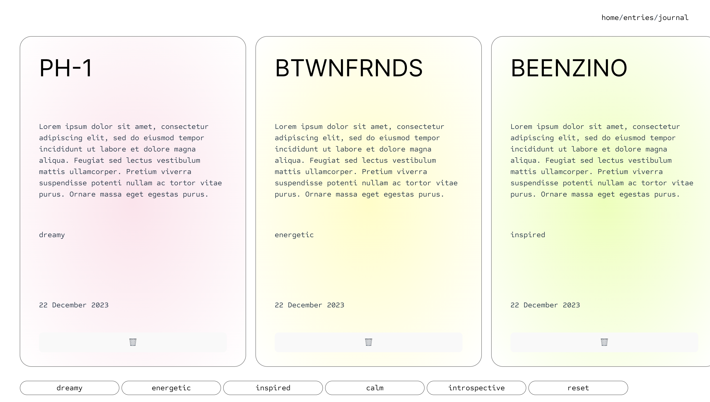
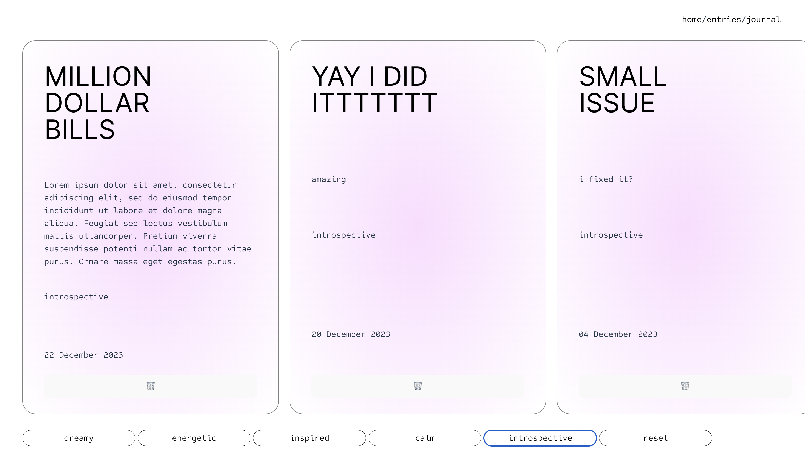
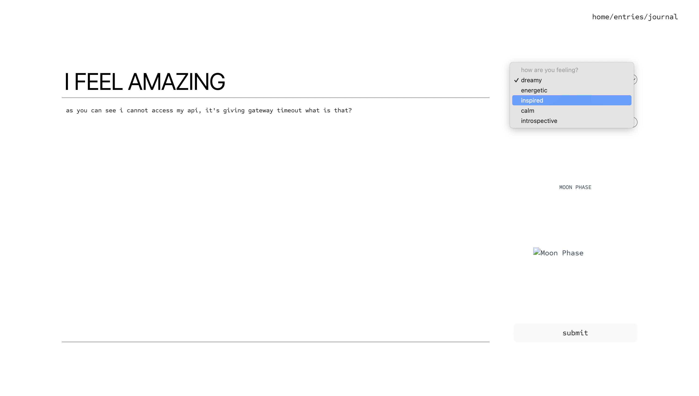

# MoodRing

## overview

MoodRing <i>(name is a work-in-progress)</i> is a personal journaling application that integrates moon phase tracking. Users can log their daily thoughts, emotions, and experiences while also keeping track of the moon phase corresponding to each entry. You can clearly tell my moods and thoughts while working on it tucked behind the example entries.

## Features

- **Journal Entries:** Record daily thoughts, emotions, and experiences.
- **Moon Phase Tracking:** Automatically capture and display the current moon phase for each entry.
- **Filter by Mood:** Easily filter and view journal entries based on mood.
- **Edit Entries:** Users can edit and update their journal entries.

## Technologies Used

- **React:** Frontend library for building user interfaces.
- **React Router:** For handling navigation within the app.
- **React-datepicker:** Date picker library for dates.
- **Date-fns:** A library for date formatting and manipulation.
- **Airtable:** Backend-as-a-Service (BaaS) for storing and managing journal entries.

## Getting started

**Feel free to play around with the app <a href="https://moodring.vercel.app/">here</a>**

**Entries**

- View all entries
- Filter through the different moods
- Delete an entry with the trashcan
- Access individual entries to edit them

**Journal**

- Create a new entry here
- Pick a mood to describe how you are feeling
- Track current moon phase
- Play around with selecting different dates to see it's corresponding moon phase

## Next steps

- Introduce horizontal scrolling to entries page
- Aesthetic improvements
- Personalise it through logins
- Interactive homepage: add more features maybe like a dashboard of sorts
- Additional features: examples like a todo list, image uploads to create a more personal space
